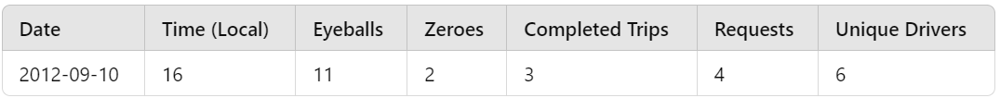

# Assignment: Uber Trip Analysis

## Overview
This repository contains solutions to an analysis assignment using a dataset from Uber, focusing on trip requests, completed trips, and driver supply over a two-week period. The aim is to derive insights into trip patterns and driver demand using various analytical techniques.

## Dataset
The dataset used for this analysis is located in the dataset_1.csv file. Each row in the dataset provides information about the number of eyeballs (app openings), zeroes (requests with no cars available), completed trips, requests, and unique drivers for each hour.

## Example Data Row:

This indicates that during the hour beginning at 4 PM on September 10th, 2012, there were 11 app openings, 2 instances with no available cars, 4 requests, and 3 completed trips, with 6 unique drivers logged in.

